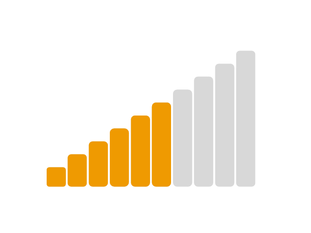

## Font Simepar Icons

(C) Copyleft SIMEPAR - Sistema Meteorológico do Paraná. See LICENSE.txt for more details

## What is it about?
Font Simpear Icons is a package that has three main icon types: 
## Stacking Icons
The concept of icon stacking is having more than one color in an icon. Basically, one has two icons and stacks one of them over the other. 

## Animated Icons
Animated icons also implement the concept of icon stacking. In addition, it can be animated by using javascript.

## Weather Icons 
These are icons related to weather, forecast and so on. They may or may not implement stacking icons.

## Getting started
To get these icons up and running it's firstly necessary to download them from Github. When it's done, there are only two steps remaining:

1- CSS: Add the font-styles.css into your project with the fonts folder. A single icon is defined by using CSS as:

```
.icon-simepar-signal-lvl-6:before {
	content: "\e60a";
}
.icon-simepar-signal-lvl-6:after {
	content: "\e605";
}
```

2- HTML: Using the i tag you can add the icons' classes:

```
<i class="icon-simepar-signal-lvl-6"></i>
```


## Animated Icons
Notice that the icon names differ only by a number, from 1 to 10, representing the amount of bars in the signal. The lvl-0 is supposed to be used as background. Doing the above steps, a static icon will be created, to make it animated it's still necessary:

1- Give an ID to the span:

```HTML
<span class="icon-simepar-signal-lvl-6 front" id="signal-current-lvl"></span>
```

2- In the javascript code, get its ID and then change the class where it's needed:

```javascript
var signal_icon = document.getElementById('signal-current-lvl'),
  desired_level = 7;
signal_icon.className = 'icon-aev-signal-lvl-' + desired_level + ' front';
```

As the icons are fonts, it's possible to change their color, size and so on through the CSS code. Since the background and the front layer are separated fonts, it's also possible to have different colors on them.

## How it was made?
Inkscape (https://inkscape.org) was used to draw the icons, the app icoMoon to convert them from svg into fonts (https://icomoon.io/) and some styles from http://css-tricks.com/stackicons-icon-fonts/ were added.